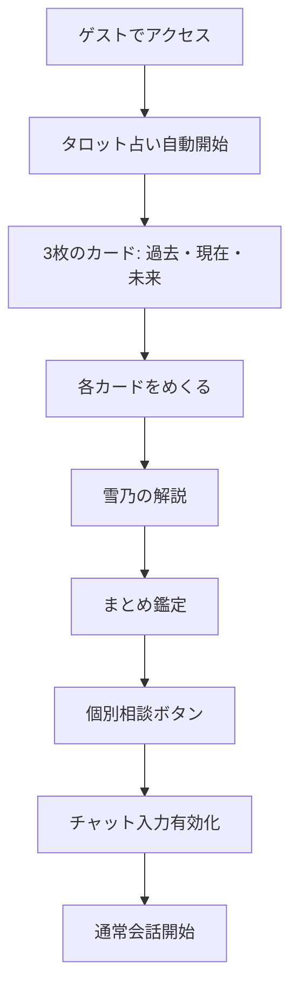

# 笹岡雪乃チャットシステム完全仕様書

**最終更新日**: 2025年12月24日  
**バージョン**: 2.0  
**担当鑑定士**: 笹岡雪乃（ささおかゆきの）

---

## 📋 目次

1. [概要](#概要)
2. [キャラクター設定](#キャラクター設定)
3. [システムアーキテクチャ](#システムアーキテクチャ)
4. [ゲストモードフロー](#ゲストモードフロー)
5. [登録ユーザーフロー](#登録ユーザーフロー)
6. [タロット占いシステム](#タロット占いシステム)
7. [データベーススキーマ](#データベーススキーマ)
8. [フロントエンド実装](#フロントエンド実装)
9. [バックエンド実装](#バックエンド実装)
10. [トラブルシューティング](#トラブルシューティング)

---

## 概要

### システムの目的

笹岡雪乃の専用チャットシステムは、以下の特徴を持つ：

- **タロット占い**: 初回訪問時に3枚のカード鑑定（過去・現在・未来）
- **個別相談**: タロット終了後、通常の会話モード
- **9通制限**: ゲストモードは9通まで、以降は登録必須
- **ゲスト再訪問制御**: 一度会話したゲストは再訪問時に強制登録
- **履歴引用**: 登録後、毎回ゲストモード時の最後のメッセージを引用

### キーコンセプト

```
ゲスト体験 → 登録促進 → 継続的エンゲージメント
```

---

## キャラクター設定

### 基本情報

- **名前**: 笹岡雪乃（ささおかゆきの）
- **年齢**: 20代後半
- **職業**: タロット占い師
- **修行**: 高野山での修行経験あり
- **性格**: 優しく、寄り添うタイプ

### 話し方の特徴

- 丁寧語を基本とする
- 相談者に寄り添う表現
- タロットカードを用いた深い洞察
- 高野山での学びを反映

---

## システムアーキテクチャ

### ファイル構成

```
public/js/
├── character-handlers/
│   └── yukino-handler.js          # 雪乃専用ハンドラー
├── features/
│   └── yukino-tarot.js             # タロット機能
├── chat-init.js                    # 共通チャット初期化
├── chat-ui.js                      # UI制御
└── chat-data.js                    # データ管理

functions/
├── _lib/
│   └── characters/
│       └── yukino.js               # AIプロンプト生成
└── api/
    └── consult.ts                  # メインAPI
```

### データフロー

```
┌─────────────┐
│ ユーザー入力 │
└──────┬──────┘
       │
       ▼
┌─────────────────┐
│ yukino-handler  │ ← ゲスト再訪問チェック
│   .js           │ ← 9通目登録確認
└──────┬──────────┘
       │
       ▼
┌─────────────────┐
│ consult.ts API  │ ← 履歴取得（DB）
│                 │ ← ゲストメッセージ抽出
└──────┬──────────┘
       │
       ▼
┌─────────────────┐
│ yukino.js       │ ← AIプロンプト生成
│ (プロンプト)     │ ← ゲストメッセージ引用
└──────┬──────────┘
       │
       ▼
┌─────────────────┐
│ LLM API         │ ← OpenAI/DeepSeek
└──────┬──────────┘
       │
       ▼
┌─────────────────┐
│ ユーザーへ返答   │
└─────────────────┘
```

---

## ゲストモードフロー

### 1. 初回訪問



### 2. 会話制限（9通目）

#### カウント方式

```javascript
// sessionStorage でカウント
yukinoConsultationMessageCount = 0

// ユーザーメッセージごとに +1
count++

// 9通目（count === 8）でneedsRegistration = true
```

#### 9通目の動作

```javascript
// 1. ゲスト履歴を仮保存
sessionStorage.setItem('pendingGuestHistoryMigration', JSON.stringify({
    character: 'yukino',
    history: guestHistory
}));

// 2. 入力欄を無効化
messageInput.disabled = true;
sendButton.disabled = true;

// 3. 「はい」「いいえ」ボタン表示
ChatUI.showYukinoRegistrationButtons();
```

### 3. 登録確認ボタン

#### 「はい」をクリック

```javascript
handleRegistrationConsent(true) {
    // ゲスト履歴は既に保存済み
    
    // 1秒後に登録画面へ
    setTimeout(() => {
        window.location.href = '../auth/register.html?redirect=' + 
            encodeURIComponent(window.location.href);
    }, 1000);
}
```

#### 「いいえ」をクリック

```javascript
handleRegistrationConsent(false) {
    // 1. お別れメッセージ表示
    const farewellMessage = 'わかりました。それではまた何かあったら連絡ください。これまでの会話の中身は私は忘れてしまうと思うので、今度来た時にはゼロから話をしてくださいね。お待ちしています。';
    ChatUI.addMessage('character', farewellMessage, '笹岡雪乃');
    
    // 2. 全履歴クリア
    this.clearGuestHistory();
    
    // 3. 3秒後にmain.htmlへ
    setTimeout(() => {
        window.location.href = '../main.html';
    }, 3000);
}
```

### 4. ゲスト再訪問制御 🆕

#### フラグ管理

```javascript
// localStorage で永続化
localStorage.setItem('yukinoGuestConversed', 'true');
```

#### 再訪問時の動作

```javascript
checkGuestRevisit() {
    // 登録済みユーザーはスキップ
    if (AuthState.isRegistered()) return;
    
    // フラグチェック
    const hasConversedAsGuest = localStorage.getItem('yukinoGuestConversed');
    
    if (hasConversedAsGuest === 'true') {
        // システムメッセージ表示
        ChatUI.addMessage('character', 
            '前回はゲストモードでお話しいただきましたが、続きをお話しするにはユーザー登録が必要です。生年月日とニックネームを登録してください。お金がかかったりはしませんから、安心してくださいね。', 
            '笹岡雪乃'
        );
        
        // 入力欄を無効化
        messageInput.disabled = true;
        sendButton.disabled = true;
        
        // 3秒後に登録画面へ強制リダイレクト
        setTimeout(() => {
            window.location.href = '../auth/register.html?redirect=' + 
                encodeURIComponent(window.location.href);
        }, 3000);
    }
}
```

---

## 登録ユーザーフロー

### 1. 登録完了直後（初回のみ）

#### データベース保存

```javascript
// pendingGuestHistoryMigration から取得
const guestHistory = JSON.parse(sessionStorage.getItem('pendingGuestHistoryMigration'));

// データベースに保存（is_guest_message = 1）
await env.DB.prepare(
    `INSERT INTO conversations (user_id, character_id, role, message, message_type, is_guest_message, timestamp)
     VALUES (?, ?, ?, ?, 'normal', 1, CURRENT_TIMESTAMP)`
).bind(user.id, 'yukino', entry.role, entry.content).run();
```

#### 画面表示

```
1. チャット画面がクリーン（過去のメッセージなし）
2. 雪乃が「おかえりなさい」メッセージ
3. ゲストモード時の最後のメッセージを引用
4. 会話継続可能
```

#### AIプロンプト（登録直後）

```javascript
if (isJustRegistered) {
    yukinoSpecificInstruction = `
========================================
【【最重要・絶対遵守】ユーザー登録直後の初回メッセージ】
========================================

相談者「${userNickname}さん」は、ゲストモードでお話をした後、ユーザー登録を完了したばかりです。

【必須の対応】：
1. **「おかえりなさい」と迎える**
   - 例：「${userNickname}さん、おかえりなさい」

2. **ユーザーの最後のメッセージを引用する**
   - 会話履歴の最後にあるユーザーの発言内容を、そのまま引用してください
   - 例：「ユーザー登録する前のメッセージは、『（ユーザーの最後のメッセージ）』でしたよね」

3. **会話を続けるか確認する**
   - 例：「どんな話をしましょうか？」

【返答の例】：
「${userNickname}さん、おかえりなさい。ユーザー登録する前のメッセージは、『（ユーザーの最後のメッセージ）』でしたよね。どんな話をしましょうか？」
========================================
`;
}
```

### 2. 再訪問時（毎回）🆕

#### データベースからゲストメッセージを抽出

```javascript
// consult.ts
if (user && characterId === 'yukino') {
    // is_guest_message = 1 のメッセージを抽出
    const guestUserMessages = conversationHistory
        .filter((msg) => msg.role === 'user' && msg.isGuestMessage === true)
        .map((msg) => msg.content);
    
    if (guestUserMessages.length > 0) {
        lastGuestMessage = guestUserMessages[guestUserMessages.length - 1];
        console.log('[consult] ゲストモード時の最後のメッセージを抽出:', lastGuestMessage);
    }
}

// プロンプトに渡す
const systemPrompt = generateSystemPrompt(characterId, {
    // ...
    lastGuestMessage: lastGuestMessage,
});
```

#### AIプロンプト（再訪問時）

```javascript
if (userNickname && hasPreviousConversation && lastGuestMessage) {
    yukinoSpecificInstruction = `
========================================
【【最重要・絶対遵守】登録済みユーザーの再訪問メッセージ】
========================================

相談者「${userNickname}さん」は既にユーザー登録を完了しており、再訪問されました。
ゲストモードで会話していた時の最後のメッセージは以下です：

**ゲストモード時の最後のメッセージ：**
「${lastGuestMessage}」

【必須の対応】：
1. **「おかえりなさい」と迎える**
   - 例：「${userNickname}さん、おかえりなさい」

2. **ゲストモード時の最後のメッセージを引用する**
   - 上記の「ゲストモード時の最後のメッセージ」を**そのまま引用**してください
   - 例：「ユーザー登録する前のメッセージは、『${lastGuestMessage}』でしたよね」

3. **会話を促す**
   - 例：「どんな話をしましょうか？」

【返答の例】：
「${userNickname}さん、おかえりなさい。ユーザー登録する前のメッセージは、『${lastGuestMessage}』でしたよね。どんな話をしましょうか？」
========================================
`;
}
```

### 3. 通常の会話

- タロット占いの提案（必要に応じて）
- 1枚カード鑑定
- 相談への回答

---

## タロット占いシステム

### 3枚カード鑑定（初回限定）

#### フロー

```
1. ゲストモードでアクセス
2. 自動的にタロット占い開始
3. 「過去」「現在」「未来」の3枚
4. 各カードをめくる → 雪乃の解説
5. まとめ鑑定
6. 「個別相談」ボタン → 通常会話モード
```

#### 実装ファイル

- `public/js/features/yukino-tarot.js`

#### sessionStorage管理

```javascript
// タロット関連フラグ
yukinoThreeCardsPrepared = 'true'        // 3枚準備済み
yukinoAllThreeCards = '[...]'            // 全カード情報
yukinoRemainingCards = '[...]'           // 残りカード
yukinoTarotCardForExplanation = '{...}'  // 解説中のカード
yukinoSummaryShown = 'true'              // まとめ表示済み
```

### 1枚カード鑑定（追加相談時）

#### トリガー

ユーザーのメッセージに「悩んでいる」「困っている」などのキーワードがある場合、AIが `[SUGGEST_TAROT]` マーカーを付ける。

#### フロー

```
1. ユーザー: 「恋愛のことで悩んでいます」
2. AI: [SUGGEST_TAROT]お悩みのようですね...
3. フロントエンド: 「タロットカードを引く」ボタン表示
4. ユーザーがクリック
5. カード表示 → めくる → 雪乃の解説
```

---

## データベーススキーマ

### conversations テーブル

```sql
CREATE TABLE IF NOT EXISTS conversations (
  id INTEGER PRIMARY KEY AUTOINCREMENT,
  user_id INTEGER NOT NULL,
  character_id TEXT NOT NULL CHECK(character_id IN ('kaede', 'yukino', 'sora', 'kaon')),
  role TEXT NOT NULL CHECK(role IN ('user', 'assistant')),
  content TEXT NOT NULL,
  timestamp DATETIME DEFAULT CURRENT_TIMESTAMP,
  message_type TEXT DEFAULT 'normal' CHECK(message_type IN ('normal', 'system', 'warning')),
  is_guest_message BOOLEAN DEFAULT 0,  -- ★ ゲストモード時のメッセージフラグ
  created_at DATETIME DEFAULT CURRENT_TIMESTAMP
);
```

### is_guest_message の使い方

| 値 | 意味 | 用途 |
|---|------|------|
| `1` | ゲストモード時のメッセージ | 登録後に引用するため |
| `0` | 登録ユーザーのメッセージ | 通常の会話履歴 |

### クエリ例

```sql
-- ゲストモード時の最後のユーザーメッセージを取得
SELECT message
FROM conversations
WHERE user_id = ? 
  AND character_id = 'yukino'
  AND role = 'user'
  AND is_guest_message = 1
ORDER BY timestamp DESC
LIMIT 1;
```

---

## フロントエンド実装

### yukino-handler.js

#### 主要メソッド

```javascript
const YukinoHandler = {
    characterId: 'yukino',
    characterName: '笹岡雪乃',
    
    // 初期化
    init() {
        // タロット機能初期化
        if (window.YukinoTarot) {
            window.YukinoTarot.init();
        }
        
        // ゲスト再訪問チェック
        this.checkGuestRevisit();
    },
    
    // ゲスト再訪問チェック
    checkGuestRevisit() {
        if (AuthState.isRegistered()) return;
        
        const hasConversedAsGuest = localStorage.getItem('yukinoGuestConversed');
        if (hasConversedAsGuest === 'true') {
            // システムメッセージ + 3秒後リダイレクト
        }
    },
    
    // ゲスト会話記録
    markGuestConversed() {
        localStorage.setItem('yukinoGuestConversed', 'true');
    },
    
    // レスポンス処理
    async handleResponse(response, character) {
        if (character !== 'yukino') return false;
        
        // ゲストモードの場合、会話記録
        if (!AuthState.isRegistered()) {
            this.markGuestConversed();
        }
        
        // 9通目チェック
        const isYukinoConsultation = sessionStorage.getItem('yukinoConsultationStarted') === 'true';
        if (isYukinoConsultation && response.needsRegistration) {
            await this.handleNinthMessageRegistration(character);
            return true;
        }
        
        return false;
    },
    
    // 9通目登録確認
    async handleNinthMessageRegistration(character) {
        // ゲスト履歴を保存
        const guestHistory = ChatData.getGuestHistory(character) || [];
        sessionStorage.setItem('pendingGuestHistoryMigration', JSON.stringify({
            character: character,
            history: guestHistory
        }));
        
        // 入力欄無効化
        messageInput.disabled = true;
        sendButton.disabled = true;
        
        // ボタン表示
        this.showRegistrationButtons();
    },
    
    // 登録確認ボタン表示
    showRegistrationButtons() {
        // 「はい」「いいえ」ボタンを動的生成
    },
    
    // 登録確認処理
    handleRegistrationConsent(consent) {
        this.hideRegistrationButtons();
        
        if (consent) {
            // 「はい」: 1秒後に登録画面へ
            setTimeout(() => {
                window.location.href = '../auth/register.html?redirect=' + 
                    encodeURIComponent(window.location.href);
            }, 1000);
        } else {
            // 「いいえ」: お別れメッセージ + 3秒後にmain.htmlへ
            ChatUI.addMessage('character', farewellMessage, this.characterName);
            this.clearGuestHistory();
            setTimeout(() => {
                window.location.href = '../main.html';
            }, 3000);
        }
    },
    
    // ゲスト履歴クリア
    clearGuestHistory() {
        AuthState.clearGuestHistory('yukino');
        sessionStorage.removeItem('guestConversationHistory_yukino');
        sessionStorage.removeItem('pendingGuestHistoryMigration');
        ChatData.setGuestMessageCount('yukino', 0);
        
        // タロット関連フラグもクリア
        sessionStorage.removeItem('yukinoThreeCardsPrepared');
        sessionStorage.removeItem('yukinoAllThreeCards');
        sessionStorage.removeItem('yukinoRemainingCards');
        sessionStorage.removeItem('yukinoTarotCardForExplanation');
        sessionStorage.removeItem('yukinoSummaryShown');
        sessionStorage.removeItem('yukinoFirstMessageInSession');
        sessionStorage.removeItem('yukinoConsultationStarted');
        sessionStorage.removeItem('yukinoConsultationMessageCount');
    },
    
    // 登録完了後処理
    async handlePostRegistration(historyData) {
        // ゲストモード会話フラグをクリア
        localStorage.removeItem('yukinoGuestConversed');
        return false; // 共通処理を続行
    }
};
```

### localStorage管理

| キー | 値 | 用途 |
|------|---|------|
| `yukinoGuestConversed` | `'true'` | ゲストで会話したことがあるフラグ |

### sessionStorage管理

| キー | 値 | 用途 |
|------|---|------|
| `guestConversationHistory_yukino` | `[...]` | ゲストモードの会話履歴 |
| `pendingGuestHistoryMigration` | `{...}` | 登録時に移行する履歴 |
| `yukinoConsultationStarted` | `'true'` | 個別相談モード開始済み |
| `yukinoConsultationMessageCount` | `'0'〜'9'` | 個別相談のメッセージ数 |

---

## バックエンド実装

### consult.ts

#### 9通目判定

```typescript
// ゲストユーザーで、9通目の場合に登録を促す
const needsRegistration = !user && characterId === 'yukino' && sanitizedGuestCount === 8;
```

#### ゲストメッセージ抽出

```typescript
let lastGuestMessage: string | null = null;

if (user && characterId === 'yukino') {
    // is_guest_message = 1 のメッセージを抽出
    const guestUserMessages = conversationHistory
        .filter((msg) => msg.role === 'user' && msg.isGuestMessage === true)
        .map((msg) => msg.content);
    
    if (guestUserMessages.length > 0) {
        lastGuestMessage = guestUserMessages[guestUserMessages.length - 1];
    }
}
```

#### プロンプト生成

```typescript
const systemPrompt = generateSystemPrompt(characterId, {
    needsRegistration: needsRegistration,
    userNickname: user?.nickname,
    hasPreviousConversation: conversationHistory.length > 0,
    userMessageCount: userMessageCount,
    isJustRegistered: isJustRegistered,
    lastGuestMessage: lastGuestMessage, // ★ 追加
});
```

### yukino.js (AIプロンプト)

#### プロンプト構造

```javascript
export function generateYukinoPrompt(options = {}) {
  const {
    userNickname,
    hasPreviousConversation,
    userMessageCount,
    isJustRegistered,
    needsRegistration,
    lastGuestMessage, // ★ 追加
  } = options;

  let yukinoSpecificInstruction = '';
  
  // 9通目：登録促進
  if (needsRegistration) {
    yukinoSpecificInstruction = `
【必須の対応】：
1. 現在までの相談を振り返る
2. ユーザー登録の必要性を伝える
3. 登録内容を説明（生年月日とニックネーム）
4. 安心感を提供（無料、安全）
5. 登録を促す
`;
  }
  // 登録直後の初回
  else if (userNickname && isJustRegistered) {
    yukinoSpecificInstruction = `
【必須の対応】：
1. 「おかえりなさい」と迎える
2. ユーザーの最後のメッセージを引用する
3. 会話を続けるか確認する
`;
  }
  // 再訪問時（ゲストメッセージがある場合）
  else if (userNickname && hasPreviousConversation && lastGuestMessage) {
    yukinoSpecificInstruction = `
【必須の対応】：
1. 「おかえりなさい」と迎える
2. ゲストモード時の最後のメッセージを引用する
   「ユーザー登録する前のメッセージは、『${lastGuestMessage}』でしたよね」
3. 会話を促す
`;
  }
  // 通常の会話
  else if (userNickname && hasPreviousConversation) {
    yukinoSpecificInstruction = `
【正しい対応】：
✅ タロット占いや通常の相談に丁寧に対応
✅ 必要に応じて、1枚のタロットカードを引くことを提案
`;
  }
  
  return yukinoSpecificInstruction;
}
```

---

## トラブルシューティング

### よくある問題

#### 1. ゲストメッセージが引用されない

**原因:**
- データベースに `is_guest_message = 1` で保存されていない
- `lastGuestMessage` が抽出できていない

**解決方法:**
```sql
-- データベースを確認
SELECT role, message, is_guest_message
FROM conversations
WHERE user_id = ? AND character_id = 'yukino'
ORDER BY timestamp DESC
LIMIT 20;
```

#### 2. ゲスト再訪問でリダイレクトされない

**原因:**
- `localStorage.yukinoGuestConversed` がセットされていない

**解決方法:**
```javascript
// ブラウザのコンソールで確認
localStorage.getItem('yukinoGuestConversed')

// 手動でセット
localStorage.setItem('yukinoGuestConversed', 'true')
```

#### 3. 9通目でボタンが表示されない

**原因:**
- `yukinoConsultationStarted` がセットされていない
- メッセージカウントが正しくない

**解決方法:**
```javascript
// sessionStorageを確認
sessionStorage.getItem('yukinoConsultationStarted')
sessionStorage.getItem('yukinoConsultationMessageCount')

// 手動でセット
sessionStorage.setItem('yukinoConsultationStarted', 'true')
sessionStorage.setItem('yukinoConsultationMessageCount', '8')
```

---

## まとめ

### システムの強み

1. **ゲスト体験の最適化**: タロット占いで興味を引く
2. **自然な登録促進**: 9通目で自然に登録を促す
3. **再訪問制御**: 一度会話したゲストは必ず登録へ
4. **継続的エンゲージメント**: 毎回ゲストメッセージを引用

### 今後の拡張可能性

- タロットカードの種類を増やす
- 占い結果の詳細化
- 相談カテゴリーの分類
- ユーザー別のカスタマイズ

---

**ドキュメント作成者**: AI Assistant  
**技術スタック**: Cloudflare Pages, D1 Database, OpenAI API  
**ライセンス**: プロプライエタリ
